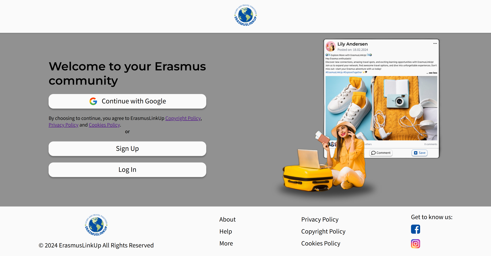
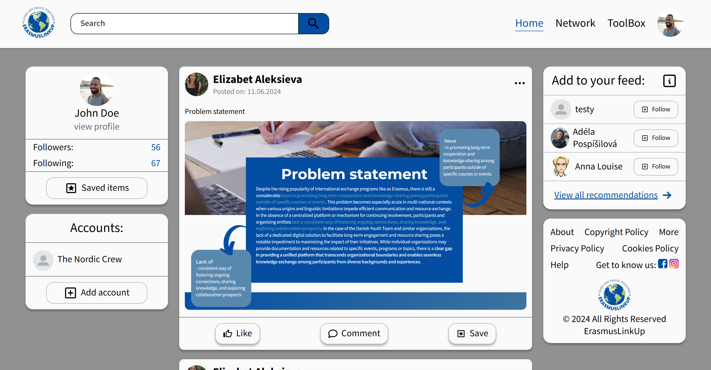
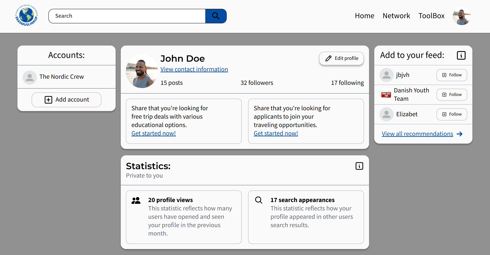
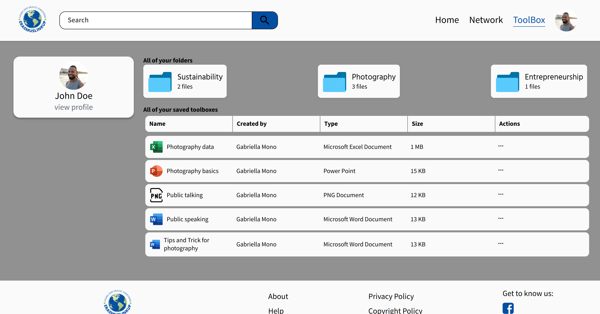
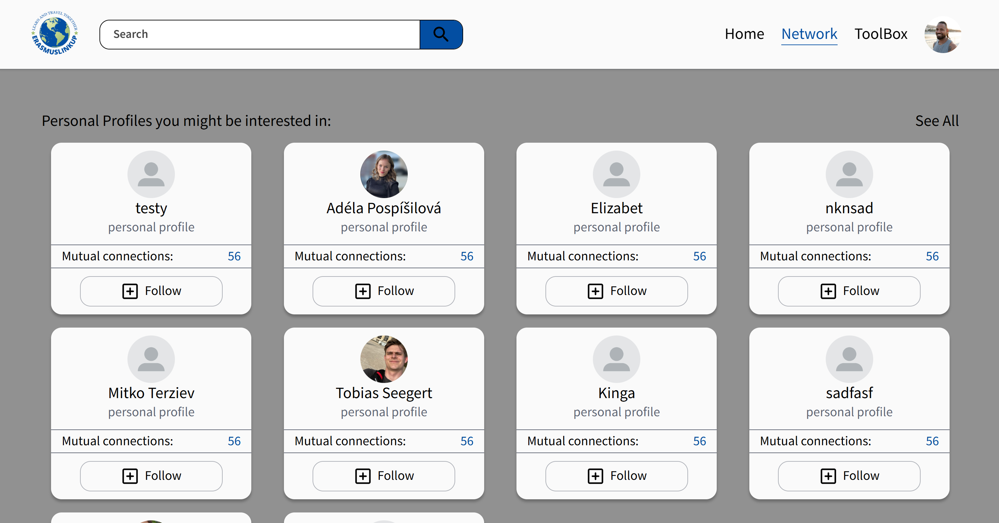

# Erasmus Link Up

**Erasmus Link Up** is a web-based platform designed to connect incoming Erasmus+ students with local peers, essential resources, and community events. Built using **Next.js** and **Firebase**, the app features real-time chat, personalized user profiles, and interactive event calendars to foster cultural integration and support networks for students.

The platform empowers students to:
- Create custom profiles
- Match with local buddies
- Access information on housing, transportation, and university services

With an emphasis on accessibility and user-centered design, Erasmus Link Up simplifies the transition to a new country, making it easier for international students to build meaningful connections and navigate their exchange experience with confidence.

---

## 🚀 Features

- **Personalized User Profiles:** Create and customize your profile to showcase your interests, background, and exchange details.
- **Feed/Homepage:** Stay up to date with community events, cultural activities, and important dates.
- **Buddy Matching:** Get paired with local students who can guide you through your exchange journey.
- **Toolbox:** Access information on housing, transportation, university services, and more.

---

## 🛠️ Technologies Used

- **Firebase:** Backend services for authentication, real-time database, and hosting.
- **React:** For creating reusable UI components.
- **CSS:** For styling.
- **Vite:** A fast, modern build tool that provides instant hot module reloading and optimized build output.  
- **react-firebase-hooks:** For easier integration with Firebase authentication and real-time data.

---

## 🔗 Live Demo

You can try out Erasmus Link Up here:  
👉 [Erasmus Link Up Demo](https://erasmuslinkup.elizabetaleksieva.com/)

Use the following credentials to log in:

- **Email:** my@email.com
- **Password:** 1234567

---

## 📄 Project Preview

---

## 📄 License

This project is licensed under the [MIT License](LICENSE).
